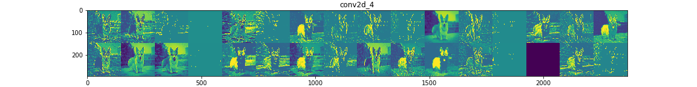
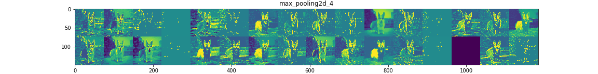
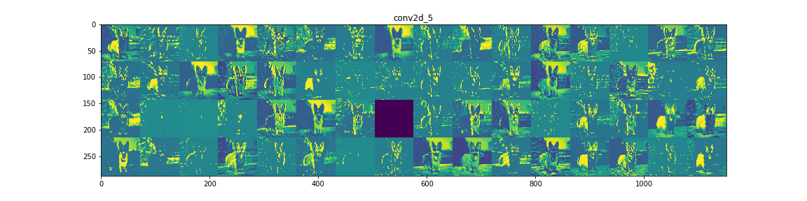
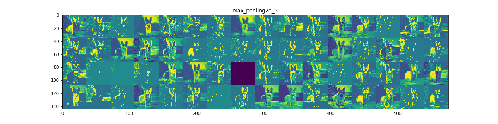
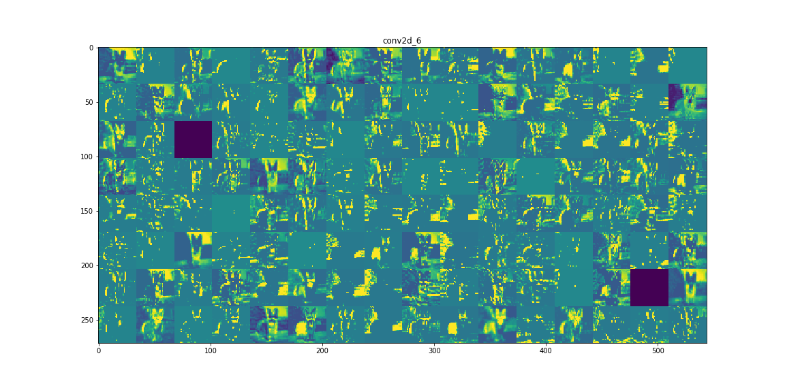
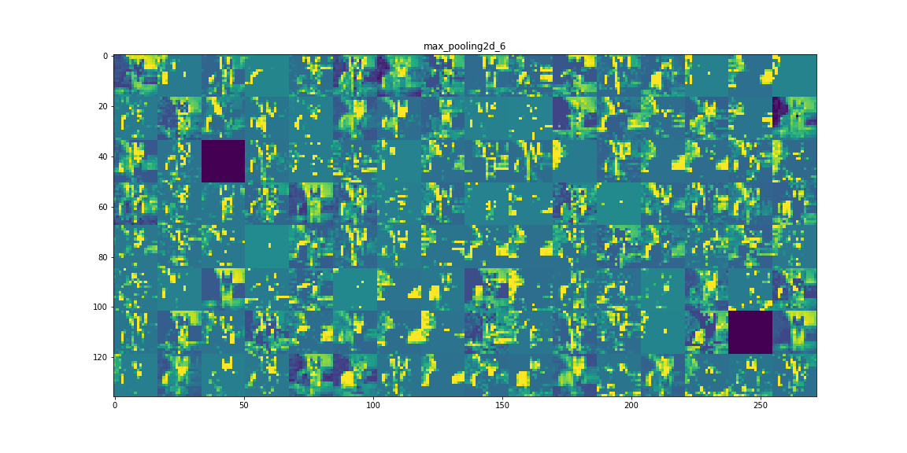
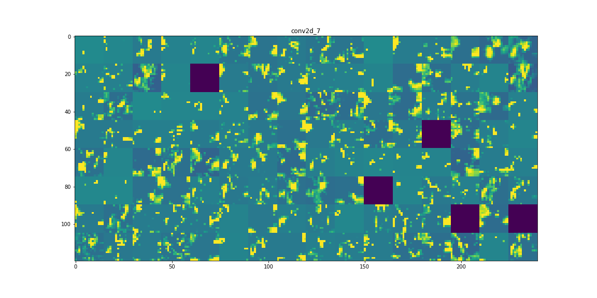
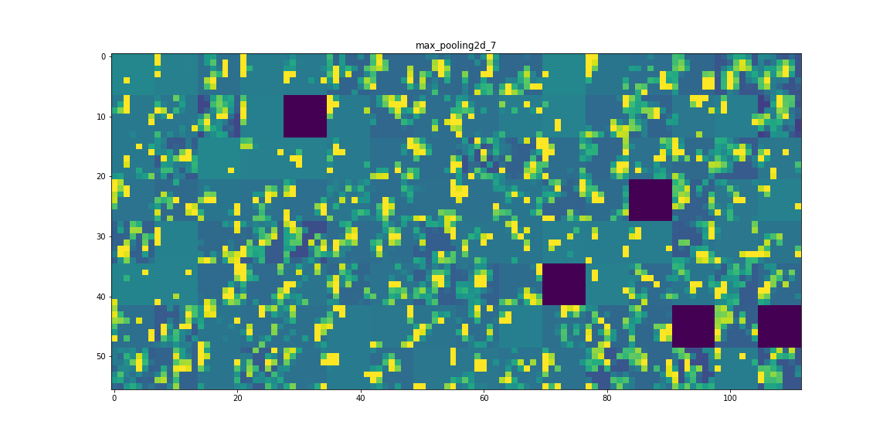

### Visualizing what convnets learn

It is often said that deep learning models are "black boxes", learning representations that are difficult to extract and present in a human-readable form. While this is partially true for certain types of deep learning models, it is definitely not true for convnets. The representations learned by convnets are highly amenable to visualization, in large part because they are representations of visual concepts.

Visualizing intermediate convnet outputs ("intermediate activations") is useful to understand how successive convnet layers transform their input, and to get a first idea of the meaning of individual convnet filters.

We will visualize the intermediate convnet outputs of a small convnet trained from scratch on the cat vs. dog classification problem.

#### Visualizing intermediate activations

Visualizing intermediate activations consists in displaying the feature maps that are output by various convolution and pooling layers in a network, given a certain input (the output of a layer is often called its "activation", the output of the activation function). This gives a view into how an input is decomposed unto the different filters learned by the network. These feature maps we want to visualize have 3 dimensions: width, height, and depth (channels). Each channel encodes relatively independent features, so the proper way to visualize these feature maps is by independently plotting the contents of every channel, as a 2D image.

#### intermediate activations, feature maps

#### See also
* [Deep Learning with Python](https://www.manning.com/books/deep-learning-with-python?a_aid=keras&a_bid=76564dff)
* [My Video](https://www.linkedin.com/posts/joseph-huang-793541167_visualizing-what-convnets-learn-1-visualizing-activity-6673808466286669824-sY-i)
